# 🚀 Multimodal ARAG Evolution Strategy

## Current State (v1)


**Limitations:**
- Text-only embeddings (notes, transcripts)
- No image understanding
- No document processing (PDFs)
- Single data type per record

---

## Future Vision (v2+)

```mermaid
graph TD
    subgraph "Data Sources"
        FieldVisits[Field Visits]
        Photos[📷 Photos]
        PDFs[📄 Soil Analysis PDFs]
        KMZ[🗺️ KMZ/Yield Maps]
        Sensors[📡 Sensor Data]
        AgKnowledge[📚 Agricultural KB]
    end
    
    subgraph "Multimodal Embedding Pipeline"
        Vision[CLIP/GPT-4V Vision]
        DocParser[Document Parser]
        GeoEmbed[Geospatial Encoder]
        TextEmbed[Text Encoder]
        
        Photos --> Vision
        PDFs --> DocParser
        KMZ --> GeoEmbed
        FieldVisits --> TextEmbed
    end
    
    subgraph "Vector Stores"
        MultiVDB[(Multimodal VectorDB)]
        SpatialIdx[(Spatial Index)]
        TemporalIdx[(Temporal Index)]
    end
    
    Vision --> MultiVDB
    DocParser --> MultiVDB
    GeoEmbed --> SpatialIdx
    TextEmbed --> MultiVDB
    
    subgraph "Query Engine"
        HybridSearch[Hybrid Multimodal Search]
        Reranker[Cross-Modal Reranker]
        LLM[Agentic LLM]
    end
    
    MultiVDB --> HybridSearch
    SpatialIdx --> HybridSearch
    HybridSearch --> Reranker
    Reranker --> LLM
```



---

## Phased Evolution

### Phase 1: Document + Image Embeddings
| Feature | Technology | Purpose |
|---------|------------|---------|
| PDF Processing | `unstructured` + LlamaParse | Extract soil analysis tables |
| Image Embeddings | CLIP / OpenAI Vision | Embed crop photos |
| Unified Storage | Qdrant or Weaviate | Native multimodal support |

### Phase 2: Spatial-Temporal Intelligence
| Feature | Technology | Purpose |
|---------|------------|---------|
| KMZ/GeoJSON Indexing | PostGIS / H3 | Field boundary queries |
| Time-Series Store | TimescaleDB | Yield history, sensor data |
| Spatial Embeddings | Geospatial transformers | Location-aware search |

### Phase 3: Knowledge Graph + Agentic RAG
| Feature | Technology | Purpose |
|---------|------------|---------|
| Agricultural KB | Neo4j / GraphRAG | Crop diseases, treatments |
| Agentic Retrieval | LangGraph / CrewAI | Multi-step reasoning |
| Memory Systems | MemGPT patterns | Long-term farm memory |

---

## Embedding Strategy

### Multimodal Embedding Model Options

| Model | Modalities | Local/Cloud | Notes |
|-------|------------|-------------|-------|
| **CLIP** | Image + Text | Both | Good baseline |
| **ImageBind** | 6 modalities | Local | Audio, depth, thermal |
| **GPT-4V + text-embedding-3** | Image + Text | Cloud | Best quality |
| **Nomic Embed Vision** | Image + Text | Local | Open source |
| **ColPali** | PDF + Text | Local | Document understanding |

### Recommended: Hybrid Approach

```python
# Future embedding pipeline concept
class MultimodalEmbedder:
    def embed(self, record):
        embeddings = []
        
        # Text embedding (existing)
        if record.text:
            embeddings.append(("text", self.text_encoder(record.text)))
        
        # Image embedding (new)
        if record.photos:
            for photo in record.photos:
                embeddings.append(("image", self.vision_encoder(photo)))
        
        # Document embedding (new)
        if record.pdfs:
            for pdf in record.pdfs:
                chunks = self.doc_parser.extract(pdf)
                for chunk in chunks:
                    embeddings.append(("doc", self.text_encoder(chunk)))
        
        # Spatial embedding (new)
        if record.geometry:
            embeddings.append(("geo", self.geo_encoder(record.geometry)))
        
        return self.fuse_embeddings(embeddings)
```

---

## Data Model Evolution

### Current
```
Visit {
  id, createdAt, lat, lon, note, 
  photo_present, audio_transcript,
  field_id, crop, issue, severity
}
```

### Future
```
FieldRecord {
  id, createdAt, geometry: Polygon
  
  # Core data
  observations: [Observation]
  
  # Attachments (multimodal)
  photos: [Photo]
  documents: [Document]  # PDFs, soil reports
  sensors: [SensorReading]
  
  # Knowledge links
  crop_kb_id: Reference
  treatment_history: [Treatment]
  
  # Embeddings (computed)
  text_embedding: Vector[1536]
  image_embeddings: [Vector[512]]
  spatial_embedding: Vector[256]
  fused_embedding: Vector[2048]
}
```

---

## Vector Store Migration Path


---

## Recommended Next Steps

1. **Short-term** (1-2 months)
   - Add CLIP image embeddings for photos
   - Integrate `unstructured` for PDF parsing
   - Store in same ChromaDB with metadata tags

2. **Medium-term** (3-6 months)
   - Migrate to Qdrant for native multimodal
   - Add H3 spatial indexing for fields
   - Build time-series view for yield history

3. **Long-term** (6-12 months)
   - Agricultural knowledge graph
   - Agentic multi-hop retrieval
   - Cross-farm federated learning

---

## Key Technologies to Evaluate

| Category | Options |
|----------|---------|
| **Multimodal VectorDB** | Qdrant, Weaviate, Milvus |
| **Document Processing** | LlamaParse, Unstructured, Docling |
| **Vision Embeddings** | CLIP, SigLIP, Nomic Vision |
| **Spatial Index** | H3, PostGIS, GeoParquet |
| **Knowledge Graph** | Neo4j, Memgraph, GraphRAG |
| **Agentic Framework** | LangGraph, CrewAI, AutoGen |
